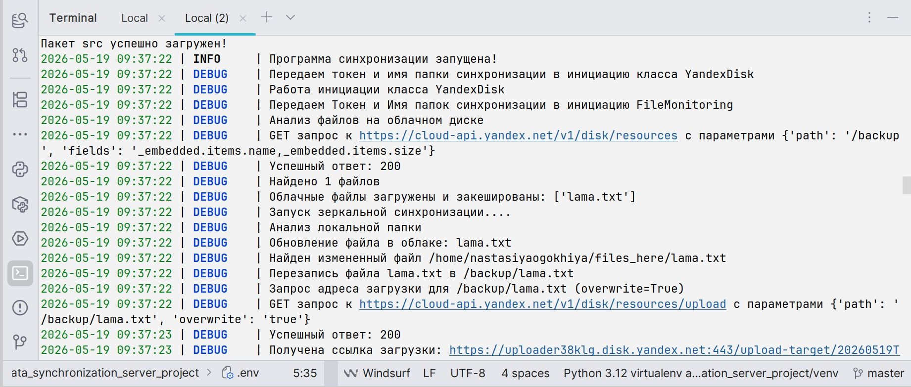

# Синхронизация локальной папки и папки на Яндекс.Диске

## Описание
Программа для зеркальной синхронизации локальной директории с папкой на Яндекс.Диске.  
При запуске содержимое локальной папки полностью копируется в облако 
(удаляются лишние файлы, добавляются новые, обновляются изменённые).  
Далее программа работает в фоне, отслеживая изменения и применяя их с заданным интервалом.

## ✨ Функционал
- Синхронизация локальной папки с папкой на Яндекс.Диске
- Периодическая синхронизация (интервал настраивается)
- Загрузка новых файлов, перезапись изменённых, удаление отсутствующих локально
- Кэширование списка облачных файлов для минимизации запросов к API

<p align="center">
  
</p>


## 📋 Требования

- Python 3.9+
- Учётная запись Яндекс.Диска
- OAuth-токен для доступа к API (инструкция по получению – ниже)

## ⚙️ Установка и настройка

1. **Клонируйте репозиторий**
   ```bash
   git clone https://github.com/your-username/data_synchronization_server_project.git
   cd data_synchronization_server_project
   ```
2. **Создание виртуального окружения, активация этого окружения,
     установка зависимостей и создание .env файла из шаблона (автоматически)**
   Для Linux/macOS:
   ```bash
   make launch-linux
   ```
   Для Windows:
   ```bash
   make launch-win
   ```
3. **Откройте .env файл и укажите обязательные переменные**
   SYNC_FOLDER=/полный/путь/к/локальной/папке
   CLOUD_FOLDER=Имя_папки_на_яндекс_диске
   TOKEN=ваш_oauth_токен_для_доступа_к_яндекс_диску
   
   Чтобы получить токен, зарегистрируйтесь или войдите в свой аккаунт в Яндексе, 
   а затем перейдите на сайт для генерации токена https://yandex.ru/dev/disk/poligon/
   Авторизация осуществляется по протоколу OAuth 2.0.

4. **Запуск**
   ```bash
   make run 
   ```


### 🧪 Тестирование, запуск тестов, покрытие
```bash
make test
make coverage
```
Покрытие тестами: **96%**

---
### 🧹 Проверка качества кода
- ruff — проверка стиля, форматирование
- mypy — проверка типов
```bash
make lint
make type-check
```


## Как работает
1. При первом запуске программа анализирует файлы в папке облака и 
   выполняет зеркальную синхронизацию: содержимое локальной папки 
   становится эталоном, всё лишнее из облака удаляется, 
   недостающее загружается, изменённое перезаписывается.
2. Затем запускается бесконечный цикл с периодической синхронизацией 
   (интервал задаётся в .env): 
   - Если файл новый — загружается на Яндекс.Диск.  
   - Если файл изменён — перезаписывается на диске.  
   - Если файл удалён — удаляется из облака.


## Логгирование
- **Консоль** – уровень `DEBUG`, цветной вывод, показывает все действия программы.
- **Файл** – путь задаётся в `.env` переменной `LOG_FILE_PATH` (по умолчанию `../logs/log_file.log`).  
  Уровень `INFO`, ротация при достижении 3 МБ, сжатие старых логов (zip), хранение 60 дней.

## ❗ Возможные ошибки
FileNotFoundError: .env not found – убедитесь, что файл .env существует в корне проекта.
Ошибка сети – проверьте интернет и правильность токена.
Файл не найден – локальная папка пуста или указан неверный путь.

## Архитектура
Архитектура в файле [ARCHITECTURE.md](./ARCHITECTURE.md)


## 🛠 Технологии

**Backend**
- Python 3.12
- Schedule
- Requests
- Loguru

**Тестирование и качество кода**
- pytest (покрытие 90%)
- ruff (линтер + форматтер)
- mypy (проверка типов)

**Управление зависимостями**
- pyproject.toml

---